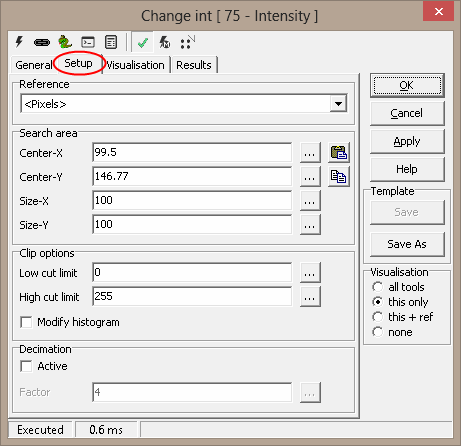
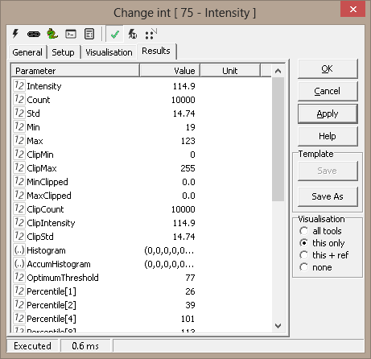

Intensity - 75
==============

===============     ===========
**Tool Name**:      Intensity 
**Tool Index:**     75  
**Tool Group:**     Basic 
===============     ===========

**Description:**

The Intensity tool processes  the intensity value of all pixels in the defined Region of Interest or search area and calculates statistical data. 

A greyscale image consists of Rows x Colums pixels with 8 bit value. The value is in the range from 0 to 255. The values is normally given the terms intensity. For a color image there are typically three color planes HSI or Hue, Saturation and Intensity. On the general tab you can select the color plane to work on. The default plane is the Intensity plane.

The ‘Intensity’ tool generates statistical data and also generates intensity histogram values. All these output parameters can be used by other Scorpion tools for further processing.

Intensity thresholds are used in several tools available in the Scorpion Vision Software, like edge detection tools, blob detection tools etc. The corresponding tools provide good flexible options for selecting the most appropriate intensity threshold for getting good results from the tool processing. However these options work on the region of interest (ROI) of that specific tool.

‘Intensity’ tool provides additional flexibility in selecting the most appropriate intensity threshold –

 (a) By allowing selection of different ROI, which is referred as the ‘Search area’ in the ‘Intensity’ tool configuration user interface.
 (b) By providing statistical data functions like average, standard deviation etc.
 (c) By providing support for clipping the range of selection based on minimum intensity and maximum intensity and providing separate statistical data for the clipped range, also providing support for the percentile values for the clipped range.

**User Interface:**

**(A) Tool Configuration dialog box – Setup Tab**

1. The **‘Reference’** drop down can be used to select the input 2D reference. The input 2D reference provides the origin (0,0) and rotation of the X and Y-axis. It is strongly recommended to click on the 'Apply' button available on the main tool configuration window, to apply the newly selected input reference. This reference is then used while configuring all other tool parameters. 
2. The **‘Search area’** group can be used for defining the region of interest (ROI) for the ‘Intensity’ tool processing. The ‘Search area’ is expected to be a rectangle.
3. **‘Center-X’** is used to provide the X co-ordinate of the center of the search area rectangle. The co-ordinates are relative to the input 2D reference.
4. **‘Center-Y’** is used to provide the Y co-ordinate of the center of the search area rectangle.
5. **‘Size-X’** is used to provide the size of the search area in the direction of the X-axis as indicated by the input 2D reference.
6. **‘Size-Y’** is used to provide the size of the search area in the direction of the Y-axis as indicated by the input 2D reference.
7. It is possible to type in fixed values for the ‘Search area’ properties – ‘Center-X’, ‘Center-Y, ‘Size-X’ and ‘Size-Y’. Also it is possible, to specify dynamic values for each one of these properties, by assigning them to any of the properties exposed from other tools defined in the Scorpion profile. The ‘…’ button available next to each of the ‘Search area’ properties user elements can be clicked to select a tool and its parameter to be assigned.

.. image:: Intensity-75-SetupSizeX.png

8. The **‘Copy’** button under the ‘Search area’ can be used to copy user defined region from the clipboard to the ‘Search area’ properties.

.. image:: Intensity_SearchAreaCopy.gif

It is expected that a rectangle is defined on the image, by pressing the CTRL keyboard key and simultaneously using mouse left button click to define vertexes of the target rectangle. When ‘Copy’ button is clicked, the search area parameters are copied from the polygon on the image and are updated in the ‘Search area’ properties on the configuration dialog box. If use has not defined a perfect rectangle, or has defined any other polygon, a bounding rectangle is calculated and is used for updating the ‘Search area’ properties on the configuration dialog box.
If only single point is selected on the image, and ‘Copy’ button is clicked, only the center of the ‘Search area’ is updated. Which means that the values for ‘Center-X’ and ‘Center-Y’ are updated whereas the values for ‘Size-X’ and ‘Size-Y’ are unchanged.
If only 2 or 3 points are selected on the image, and the ‘Copy’ button is clicked, it is ignored and has no effect.

9. The **‘Paste’** button under the ‘Search area’ can be used to paste the ‘Search area’ properties to the clipboard. This is useful in viewing the exact location of the search area on the inspection image and fine-tuning, if required.
10. The **‘Clip options’** group can be used to clip the range of the pixels used for statistical data generation. The ‘Intensity’ tool outputs statistical data based on all the pixels from the defined ‘Search area’, and also outputs separate statistical data for clipped pixels. 
11. The **‘Low cut limit’** can be used to specify the lower limit of clipping. All pixels having intensity values lower then this threshold; are not included in the clipped pixels, which are used for the clipped pixels statistical data generation.
12. The **‘High cut limit’** can be used to specify the upper limit of clipping. All pixels having intensity values higher then this threshold; are not included in the clipped pixels, which are used for the clipped pixels statistical data generation.
13. The **‘Modify histogram’** check box can be enabled to update the output histogram based on the clipped range. If this is unchecked, the output histogram is generated based on all the pixels in the ‘Search area’.
14. The **‘Decimation’** group is used for applying decimation, which indicates the skipping of pixels, during the ‘Intensity’ tool processing. Decimation is normally used for reducing the processing time. The reduction is significant.
15. The **‘Active’** check-box can be enabled to enable the decimation.
16. The **‘Factor’** can be used to specify the decimation factor. Lower value indicates lesser decimation and hence larger processing time. And higher value of factor indicates larger decimation and hence smaller processing time. The ‘…’ button available next to the ‘Factor’ can be clicked to select a tool and its parameter to be assigned as the ‘Factor’ value.

**Basic Processing when the tool is executed:**

 1. Intensity values for all the pixels in the specified ‘Search area’ are access.
 2. These intensity values are processed to generate the statistical data sent out from the ‘Intensity’ tool.

**Inputs to the Tool:**

================      ===============================================================================================================================================================
Inputs:               1. Values of different tool parameters used in the  configuration,at the time of processing, if dynamic values are used for any of the configuration parameters 
Uses Reference:       Yes, uses a 2D reference 
Uses Image:           Yes
================      ===============================================================================================================================================================

**Results:**

**Outputs from the Tool:**

====================  			========  		========================================================================================================================================================================================================================================================================================================================================================================================================================================================================================================================================================================================================
1.Intensity: 				Numeric 		Average intensity of all the pixels in the ‘Search area’ 
2.Count: 				Numeric 		Total number of pixels available in the ‘Search area’. Please note that when 'Decimation' is enabled, the Count indicates the actual processed pixels after decimation. 
3.Std: 					Numeric 		Standard deviation calculated on the intensity values of all the pixels in the ‘Search area’ 
4.Min: 					Numeric 		Minimum intensity value observed in the ‘Search area’ 
5.Max: 					Numeric 		Maximum intensity value observed in the ‘Search area’ 
6.ClipMin: 				Numeric 		Minimum intensity value observed in the clipped pixel range 
7.ClipMax: 				Numeric 		Maximum intensity value observed in the clipped pixel range 
8.MinClipped:  				Numeric 		Percentage of pixels which are excluded from the clipped pixels, due to the ‘Low cut limit’ validation. Percentage is calculated with respect to the 'Count' 
9.MaxClipped:  				Numeric 		Percentage of pixels which are excluded from the clipped pixels, due to the ‘High cut limit’ validation. Percentage is calculated with respect to the 'Count' 
10.ClipCount:  				Numeric 		Number of pixels in the clipped range. Please note that when 'Decimation' is enabled, the ClipCount indicates the actual processed pixels in the clipped range, after decimation. 
11.ClipIntensity:  			Numeric 		Average intensity of all the pixels in the clipped range.
12.ClipStd:  				Numeric 		Standard deviation calculated on the intensity values of all the pixels in the clipped range.
13.Histogram:  				Array 			Array representing the histogram generated based on the intensity values of the pixels. If ‘Modify histogram’ option is selected, histogram is generated based on the clipped range; otherwise the histogram is generated based on all the pixels in the search area. The output histogram is an array of size 256, and each element represents the frequency of occurrence of the associated intensity value (0 to 255) in the target pixels. 
14.AccumHistogram:  			Array 			Array representing the accumulated histogram generated based on the intensity values of the pixels. If ‘Modify histogram’ option is selected, histogram is generated based on the clipped range; otherwise the histogram is generated based on all the pixels in the search area. The output histogram is an array of size 256, and each element represents the accumulated frequency of occurrence of the associated intensity value (0 to 255) in the target pixels. Accumulated frequency indicates the occurrence of the associated value and all occurrences of intensity values lesser than it. 
15.OptimumThreshold:  			Numeric 		Optimum threshold calculated using advanced algorithms. This can be used as a dynamic intensity threshold by other Scorpion tools like edge detection tools and blob detection tools for getting best results 
16.Percentile[<n>]:  			Numeric 		Percentile calculated based on the intensity values of all the pixels in the search area. Following percentiles are available - 1, 2, 4, 8, 10, 20, 30, 40, 50, 60, 70, 80, 90, 92, 96, 98, 99. E.g. Percentile[1] indicates Percentile 1 value. 
17.StatusText: 				Text 			This is a standard output from all Scorpion tools and describes the processing status 
18.Status:  				Numeric 		This is a standard output from all Scorpion tools and indicates error/success of the tool processing. 1 indicates success and 0 indicates error. 
19.AnalyzeTime: 			Numeric 		This is a standard output from all Scorpion tools and indicates the time taken by the last processing operation of this tool 
====================  			========  		========================================================================================================================================================================================================================================================================================================================================================================================================================================================================================================================================================================================================

Visualizations: 1 ROI: Displays the search area rectangle 
Reference outputs: None 
    

**Templates:** 
Supports Templates: No 

    
ExecuteCmd Support:   `More information <http://scorpion.tordivel.no/help/Tools/Terms/term_tool%20executeCmd.htm>`_

===========		=========================================================================	======================================	 =======================
 Command 		Arguments 									Return value 				 Description 
1 “Set” 		“Object=ROI;Value=<polygon>”							| Tuple, where  first element 		 Sets the search area
			 | where <polygon> is the array of 						| indicates success(1) or failure (0)
			 | polygon vertex points indicating 
			 | region of interest (ROI)  
2 "Set" 		“Object=ROI;Value=<cx>,<cy>,<dx>,<dy>”						| Tuple, where  first element 		 Sets the search area
			 | where <cx> is the X co-ordinate of the center of the rectangle,		| indicates success(1) or failure (0)
			 | <cy> is the Y co-ordinate of the center of the rectangle, 
			 | <dx> is the size of the rectangle in X direction, 
			 | <dy> is the size of the rectangle in Y direction                 
3 "Get" 		“Object=ROI”									| Tuple, where first element 		 Gets the search area
													| indicates success(1) or failure (0), 
                                                                                     			| second element is an array 
                                                                                     			| indicating the search area 
                                                                                     			| rectangle polygon 
===========		=========================================================================	======================================	 =======================

Please refer to the `Copy/paste ROIs  <http://scorpion.tordivel.no/help/Tools/Terms/Term_CopyPasteROI.htm>`_
for more information on 'Copy Paste ROI using executeCommand'.

**Following is sample python code for demo**

.. code:: python

  	def my_function():
      	"just a test"
     	print 8/2

